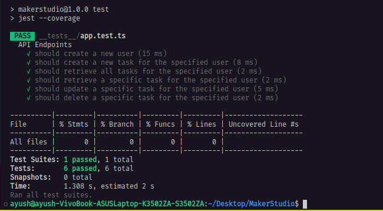

# Effect-Ts Assignment 

## Architecture 


1. I have implemented two services in this application
   - TaskRepository Service 
     - > class TaskRepository extends Context.Tag("TaskRepository")<
  TaskRepository,
  Effect.Effect.Success< typeof makeTaskRepository >>() {static readonly Live=Layer.effect(TaskRepository, makeTaskRepository);
}

   - Express Service   
     - >class Express extends Context.Tag("Express")<
  Express,
  ReturnType< typeof express>>(){static readonly Live = Layer.sync(Express, () =>const app = express();
    app.use(bodyParser.json());
    return app;
  })}


2. I have implemented `six` layers in this application with `two service` dependancy which are `Express.Live` and `TaskRepository.Live` that are chained using piping functionality of Effect.ts and I have used `pipe` operator here. 
3. I have used `Ref` for the state Management for the `TaskRepository`.
4. For Each API EndPoints or Route I am creating a new Layer which retrieves the Express app Instance and making a `runtime` configured Sepcially for the `TaskRepository` Service which run the Effects in parallel using fibres.
5. Most of the functions are clubbed by piping mechanism.
   

# Installation 

1. Clone the Repository

```bash
      https://github.com/Ayush-Vish/effect-ts-assignment.git 

```

2. Change the Directory 
```bash
      cd effect-ts-assignment
```

3. Run npm install 
```bash
      npm install 
```

4. Run the Server 

```bash
      npm run dev 
``` 


## API EndPoints 

1. Create a new user:
```
curl -X POST -H "Content-Type: application/json" http://localhost:3000/users
```

2. Create a new task for a specified user:

```
curl -X POST -H "Content-Type: application/json" -d '{
    "name":"Task 1 ", 
    "status" :"Pending" ,
    "description":"Hello"
}' http://localhost:3000/users/<user_id>/tasks
``` 

3. Retrieve all tasks for a specified user:

```
curl -X GET http://localhost:3000/users/<user_id>/tasks 
``` 
4. Retrieve a specific task for a specified user:

```
curl -X GET http://localhost:3000/users/<user_id>/tasks/<task_id>
```
5. Update a specific task for a specified user:

```
curl -X PUT -H "Content-Type: application/json" -d '{
    "name":"Task 1 ", 
    "status" :"Pending" ,
    "description":"Hello"
}' http://localhost:3000/users/<user_id>/tasks/<task_id>
```
6. Delete a specific task for a specified user:

```
curl -X DELETE http://localhost:3000/users/<user_id>/tasks/<task_id> 
```

## How to run test 
> Initailze `Jest` ``` npx ts-jest config:init ```

> Run the Server locally and  Simply run `npm run test`. 

